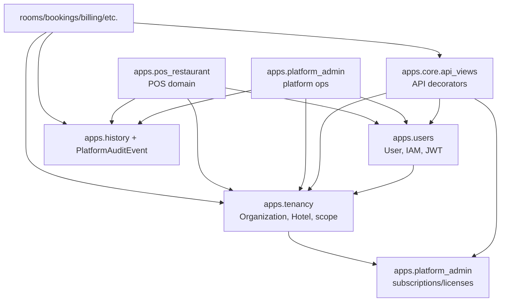

# AFRIVO Architecture Refactor - Phase 0 Inventory

Status: 100% complete for Phase 0  
Date: 2026-05-22  
Scope: architecture cartography only. No runtime code, model, migration, endpoint, or frontend route is changed by this phase.

## Objective

Phase 0 prepares the future modular architecture around IAM, tenants, licensing, super root/platform administration, and audit logs without breaking the current AFRIVO codebase.

The goal is to identify:

- the current source of truth for users, roles, permissions, sessions, tokens, hotels, organizations, subscriptions, licenses, and audits;
- the services and decorators that enforce access today;
- the dependency points that future facade apps must preserve;
- the safest extraction order for the next phases.

## Current Domain Map

| Target domain | Current source of truth | Notes |
| --- | --- | --- |
| IAM users | `backend/apps/users/models.py` | `User` is the custom auth model and must remain the canonical user model during migration. |
| IAM roles and permissions | `backend/apps/users/models.py`, `backend/apps/users/access.py` | Fine-grained roles already exist through `IAMRole`, `IAMPermission`, role assignments, overrides, and module permissions. |
| Sessions and tokens | `backend/apps/users/models.py`, `backend/apps/users/jwt_auth.py`, `backend/apps/users/api_views.py` | Existing JWT/session behavior must remain untouched in the first extraction phases. |
| Tenant organizations and hotels | `backend/apps/tenancy/models.py` | `Organization`, `Hotel`, and `HotelSettings` are the current tenant foundation. |
| Hotel scoping | `backend/apps/tenancy/drf.py`, `backend/apps/tenancy/utils.py`, `backend/apps/core/api_views.py` | Scope is enforced by request attachment, DRF permissions, queryset mixins, and decorators. |
| Platform admin | `backend/apps/platform_admin/` | Contains platform operations, dashboard APIs, hotels, modules, subscriptions, licenses, and platform audit events. |
| Licensing | `backend/apps/platform_admin/models.py`, `backend/apps/platform_admin/services.py`, `backend/apps/tenancy/utils.py` | Subscription and module license logic is centralized in platform admin but consumed by tenancy guards. |
| Audit logs | `backend/apps/history/`, `backend/apps/platform_admin/`, `backend/apps/pos_restaurant/audit.py` | Audit is split between sealed hotel activity logs, platform audit events, and POS logger output. |
| POS access | `backend/apps/pos_restaurant/models.py`, `backend/apps/pos_restaurant/permissions.py` | `UserPosAccess` extends normal users with restaurant-specific access. |

## Model Inventory

### IAM and Auth

| Model | File | Responsibility | Future target |
| --- | --- | --- | --- |
| `User` | `backend/apps/users/models.py` | Custom auth user, platform role, hotel/org ownership, 2FA flags, lockout fields. | `apps.iam.models.user` facade first, physical move later only if needed. |
| `UserModulePermission` | `backend/apps/users/models.py` | Legacy/module permission matrix by user and module code. | `apps.iam.models.permission` facade. |
| `IAMRole` | `backend/apps/users/models.py` | Canonical role catalog. | `apps.iam.models.role` facade. |
| `IAMPermission` | `backend/apps/users/models.py` | Canonical permission catalog. | `apps.iam.models.permission` facade. |
| `IAMRolePermission` | `backend/apps/users/models.py` | Role-permission mapping. | `apps.iam.models.permission` facade. |
| `UserPermissionOverride` | `backend/apps/users/models.py` | Per-user permission override. | `apps.iam.models.permission` facade. |
| `UserOrganizationRole` | `backend/apps/users/models.py` | User role at organization scope. | `apps.iam.models.role` facade. |
| `UserHotelRole` | `backend/apps/users/models.py` | User role at hotel scope. | `apps.iam.models.role` facade. |
| `UserSession` | `backend/apps/users/models.py` | Refresh token session tracking and revocation. | `apps.iam.models.session` facade. |
| `BlacklistedToken` | `backend/apps/users/models.py` | Revoked JWT/token storage. | `apps.iam.models.session` facade. |

### Tenants

| Model | File | Responsibility | Future target |
| --- | --- | --- | --- |
| `Organization` | `backend/apps/tenancy/models.py` | SaaS organization/container. | `apps.tenants.organizations` facade. |
| `Hotel` | `backend/apps/tenancy/models.py` | Hotel tenant unit linked to organization. | `apps.tenants.hotels` facade. |
| `HotelSettings` | `backend/apps/tenancy/models.py` | Hotel operational settings. | `apps.tenants.hotels` facade. |

### Licensing and Platform Admin

| Model | File | Responsibility | Future target |
| --- | --- | --- | --- |
| `SubscriptionPlan` | `backend/apps/platform_admin/models.py` | Commercial plan and quotas. | `apps.licensing.plans` facade. |
| `HotelSubscription` | `backend/apps/platform_admin/models.py` | Hotel subscription state and billing cycle. | `apps.licensing.subscriptions` facade. |
| `PlatformModule` | `backend/apps/platform_admin/models.py` | Licensed module catalog. | `apps.licensing.module_licenses` facade. |
| `PlatformLicense` | `backend/apps/platform_admin/models.py` | Organization/hotel module license. | `apps.licensing.module_licenses` facade. |
| `PlatformAuditEvent` | `backend/apps/platform_admin/models.py` | Platform-level audit trail. | `apps.audit_logs` facade, with platform namespace preserved. |

### Audit

| Model | File | Responsibility | Future target |
| --- | --- | --- | --- |
| `HistoryEntry` | `backend/apps/history/models.py` | Legacy history event source. | Keep compatibility; expose through audit facade. |
| `ActivityLog` | `backend/apps/history/models.py` | Hotel-scoped sealed activity log with integrity hash chain. | `apps.audit_logs` facade. |
| POS logger | `backend/apps/pos_restaurant/audit.py` | Structured logger for POS actions. | Later bridge to unified audit service. |

### POS Restaurant

| Model | File | Responsibility | Future target |
| --- | --- | --- | --- |
| `Restaurant` | `backend/apps/pos_restaurant/models.py` | Restaurant bound to hotel. | Remains POS-owned. |
| `UserPosAccess` | `backend/apps/pos_restaurant/models.py` | POS-specific role and access assignment. | Remains POS-owned, consumes IAM user and tenant facades. |
| Dining/menu/order/billing models | `backend/apps/pos_restaurant/models.py` | Restaurant operations domain. | Remains POS-owned. |

## Current Service and Enforcement Inventory

### IAM and Permission Decision Points

| Function/class | File | Current role |
| --- | --- | --- |
| `user_can_access` | `backend/apps/users/access.py` | Main module/action permission decision. |
| `can_perform_action` | `backend/apps/users/access.py` | Fine-grained IAM action decision. |
| `can_manage_user` | `backend/apps/users/access.py` | Determines user management hierarchy. |
| `can_assign_role` | `backend/apps/users/access.py` | Determines whether an actor can assign a scoped role. |
| `api_login_required` | `backend/apps/core/api_views.py` | Resolves API user and attaches active hotel. |
| `module_permission_required` | `backend/apps/core/api_views.py` | Enforces module permission by HTTP action. |
| `module_hotel_scope_required` | `backend/apps/core/api_views.py` | Enforces valid tenant/hotel scope. |
| `module_license_required` | `backend/apps/core/api_views.py` | Enforces active module license. |
| `UserManagementPermission` | `backend/apps/users/permissions.py` | DRF permission for user management. |
| `HasPosAccess` | `backend/apps/pos_restaurant/permissions.py` | POS restaurant API access gate. |
| `CanManagePosAccess` | `backend/apps/pos_restaurant/permissions.py` | POS access administration gate. |

### Tenant and Scope Points

| Function/class | File | Current role |
| --- | --- | --- |
| `attach_request_hotel` | `backend/apps/tenancy/utils.py` | Attaches active hotel to request. |
| `get_user_hotel` | `backend/apps/tenancy/utils.py` | Resolves hotel from user/request context. |
| `user_has_valid_tenant` | `backend/apps/tenancy/utils.py` | Checks user/tenant consistency. |
| `is_platform_scope_user` | `backend/apps/tenancy/utils.py` | Recognizes platform-scope users. |
| `filter_for_active_hotel` | `backend/apps/tenancy/utils.py` | Filters querysets by active hotel. |
| `AuthenticatedHotelPermission` | `backend/apps/tenancy/drf.py` | DRF authentication, tenant, subscription, and license check. |
| `HotelScopedQuerysetMixin` | `backend/apps/tenancy/drf.py` | Queryset filtering by hotel scope. |

### Licensing Points

| Function/model | File | Current role |
| --- | --- | --- |
| `platform_module_access_allowed` | `backend/apps/platform_admin/services.py` | Final decision for module license access. |
| `process_subscription_lifecycle` | `backend/apps/platform_admin/services.py` | Batch subscription lifecycle processing. |
| `renew_platform_subscription` | `backend/apps/platform_admin/services.py` | Subscription renewal workflow. |
| `change_platform_subscription_plan` | `backend/apps/platform_admin/services.py` | Plan change workflow. |
| `renew_platform_license` | `backend/apps/platform_admin/services.py` | Module license renewal workflow. |
| `suspend_platform_license` | `backend/apps/platform_admin/services.py` | Module license suspension workflow. |
| `module_license_is_active` | `backend/apps/tenancy/utils.py` | Runtime module license check consumed by guards. |
| `hotel_subscription_is_active` | `backend/apps/tenancy/utils.py` | Runtime hotel subscription check consumed by guards. |

### Audit Points

| Function/model | File | Current role |
| --- | --- | --- |
| `log_activity` | `backend/apps/history/services.py` | Creates sealed `ActivityLog` entries. |
| `ActivityLog.verify_integrity` | `backend/apps/history/models.py` | Verifies audit hash chain entry. |
| `ActivityLogViewSet.integrity` | `backend/apps/history/views.py` | Exposes integrity health endpoint. |
| `create_platform_audit_event` | `backend/apps/platform_admin/services.py` | Creates platform audit records. |
| `_audit_iam_change` | `backend/apps/users/iam_api_views.py` | Audits IAM assignments and revocations. |
| `_audit_iam_role_change` | `backend/apps/users/iam_api_views.py` | Audits IAM role/permission catalog changes. |
| `pos_audit_logger` | `backend/apps/pos_restaurant/audit.py` | Logs POS operational events. |

## Endpoint Inventory

| Area | URL config | Notes |
| --- | --- | --- |
| Auth/users | `backend/apps/users/urls.py`, `backend/apps/users/iam_urls.py` | Login/session/user management and IAM API endpoints. |
| Tenant settings | `backend/apps/tenancy/urls.py` | Hotel settings and tenant-related APIs. |
| Platform admin | `backend/apps/platform_admin/urls.py` | Organizations, hotels, modules, licenses, subscriptions, users, security. |
| Audit/history | `backend/apps/history/urls.py` | Activity logs, integrity, role-permission history. |
| POS Restaurant | `backend/apps/pos_restaurant/urls.py` | POS tables, orders, menu, kitchen, payments, reports, access. |
| Core dashboard APIs | `backend/apps/core/api_urls.py` | Shared dashboard/authenticated module APIs. |

## Dependency Map

## Key Risks Before Refactor

1. `User` is the auth model. Moving it physically would be high-risk and should not happen in the first migration waves.
2. Permission logic is called from decorators, DRF permissions, platform admin, POS, and many business modules. It needs a facade first, not a direct move.
3. Licensing is defined in `platform_admin` but enforced in `tenancy` and `core`. A direct app split would create circular import risk unless a service facade is introduced.
4. Audit is not one system today: `ActivityLog`, `PlatformAuditEvent`, and POS logger coexist. Phase 1 should unify write APIs before merging storage.
5. Hotel scope is enforced by both decorators and DRF mixins. Any tenant extraction must preserve request attributes such as `request.active_hotel`.
6. Platform admin routes and frontend screens expect the current endpoints. Route compatibility must be kept throughout the migration.

## Recommended Implementation Strategy

### Phase 1 - IAM Facade, No Data Move

Create `backend/apps/iam/` as a service facade that imports current `apps.users` models/services internally:

- `apps/iam/services/auth_service.py` wraps current login/session helpers.
- `apps/iam/services/token_service.py` wraps JWT and blacklist logic.
- `apps/iam/services/permission_service.py` wraps `user_can_access`, `can_perform_action`, `can_manage_user`, and `can_assign_role`.
- `apps/iam/api/permissions.py` exposes reusable DRF permission classes.

Compatibility rule: existing endpoints keep working, then new code starts importing from IAM facade.

### Phase 2 - Tenants Facade

Create `backend/apps/tenants/` around the existing `apps.tenancy` models:

- `tenants/organizations` wraps `Organization`.
- `tenants/hotels` wraps `Hotel` and `HotelSettings`.
- `tenants/memberships` wraps `UserOrganizationRole`, `UserHotelRole`, and scoping helpers.

Compatibility rule: preserve `apps.tenancy` models and migrations until imports are stable.

### Phase 3 - Licensing Facade

Create `backend/apps/licensing/` around current platform licensing models:

- `plans` wraps `SubscriptionPlan`.
- `subscriptions` wraps `HotelSubscription`.
- `module_licenses` wraps `PlatformModule` and `PlatformLicense`.

Compatibility rule: move runtime license decisions behind a `licensing.services.access_service` facade, then update `tenancy.utils` to call that facade.

### Phase 4 - Audit Facade

Create `backend/apps/audit_logs/` with one write API:

- hotel audit writes to `ActivityLog`;
- platform audit writes to `PlatformAuditEvent`;
- POS audit calls the same facade with `domain="pos_restaurant"`.

Compatibility rule: keep the sealed `ActivityLog` integrity behavior unchanged.

### Phase 5 - Optional Physical Moves

Only after all imports use facades and tests are green:

- decide whether models stay in legacy apps permanently;
- or move models with explicit migration strategy and `db_table` preservation.

For this project, the safer long-term choice is facade-first, physical move later only where it gives a real benefit.

## Frontend Impact Map

| Frontend area | Current concern | Safe next step |
| --- | --- | --- |
| Main hotel app | Uses existing auth/session and module permissions. | No Phase 0 change. |
| Platform admin | Uses platform user/hotel/licensing endpoints. | Keep endpoints stable; consume backend facades only internally. |
| POS Restaurant | Uses existing user auth plus `UserPosAccess`. | Keep autonomous UI, but resolve access through IAM facade later. |
| Shared API client | Stores auth/cookies/tokens. | Do not change until IAM facade is verified. |

## Phase 0 Completion Checklist

- [x] Current IAM models identified.
- [x] Current auth/session/token models identified.
- [x] Current permission decision functions identified.
- [x] Current tenant models and scoping helpers identified.
- [x] Current subscription and licensing models identified.
- [x] Current runtime license checks identified.
- [x] Current audit stores and write paths identified.
- [x] Platform admin dependencies identified.
- [x] POS Restaurant access dependencies identified.
- [x] Frontend impacted areas identified.
- [x] Refactor risks documented.
- [x] Next-phase extraction order defined.

## Phase 0 Decision

Phase 0 is complete. The project is ready for Phase 1: introduce the `apps.iam` facade without moving database tables, without changing the auth endpoint, and without breaking existing imports.

